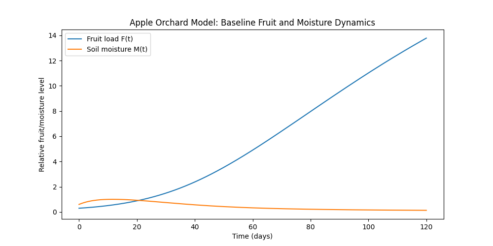
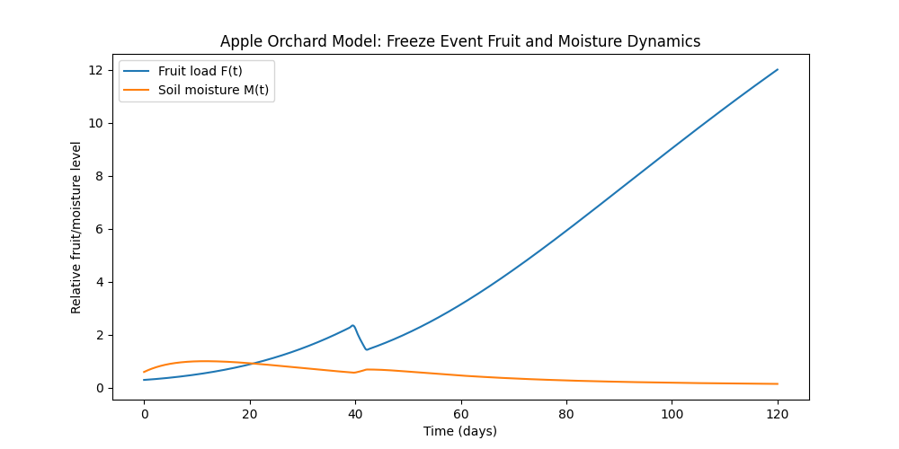
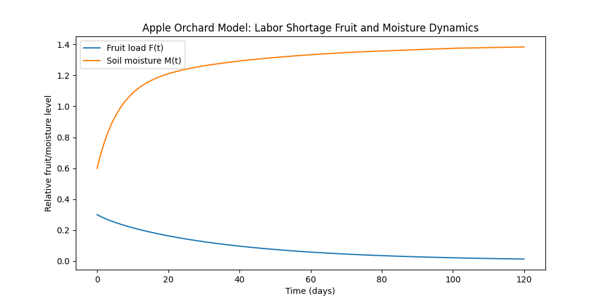
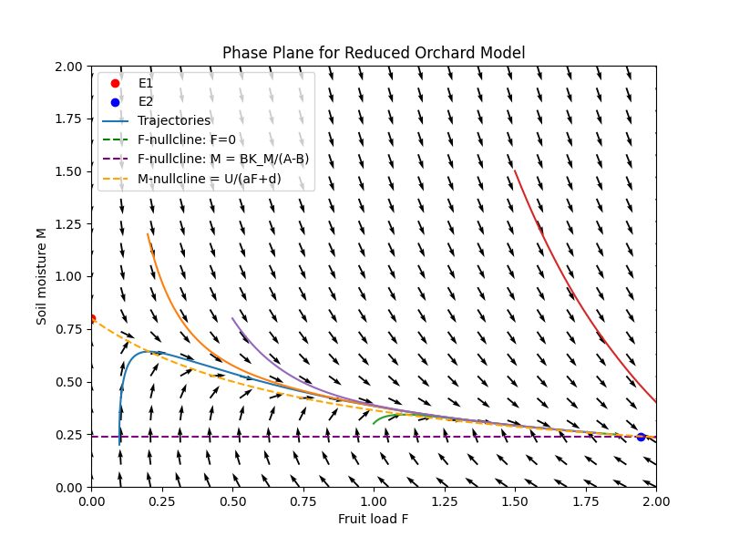

# Apple-Orchard-Yield-Modeling-ODEs
This project models apple orchard fruit production as influenced by a variety of environmental and operational factors using ordinary differential equations. A paper on the topic is included in the repo.

## Overview

This project develops a mathematical model to study how apple orchard yield evolves over time, and is based on a system of nonlinear ordinary differential equations. It captures the interaction between fruit production and soil moisture and incorporates real-world factors such as temperature, labor availability, pest pressure, rainfall, and irrigation. The goal is to understand how these factors influence long-term orchard sustainability and fruit yield and to have a tool for forecasting probable fruit yield under impending conditions to influence decision making and expectation of economic outcome. 

## Motivation

Apple production in the U.S. is highly concentrated in the region of the Pacific Northwest and more specifically Washington state, and plays a significant role in agriculture and agricultural markets. Orchard yield is highly uncertain season to season and is influenced by extenuating factors outside of farmer control, including but not limited to:

- Environmental conditions (weather, freeze events)
- Operational factors (labor availability)
- Biological factors (pests, soil conditions)

Farmers and investment managers at impact strategy investment firms, centered around ownership of sustainably managed agricultural properties as a means of generating returns for investors, often need to make decisions under this uncertainty. A structured mathematical model can help:

- Understand how these factors interact
- Anticipate outcomes and their economic implications
- Improve planning and forecasting especially with awareness around certain known impending conditions

## Model Description

The model tracks two main variables: 

- Fruit load $F(t)$, representing yield
- Soil moisture $M(t)$, representing available water in the system

The system is **coupled**, meaning fruit growth depends on soil moisture and soil moisture in the system is reduced my fruit growth (water uptake). Fruit dynamics include a growth term that depends on moisture and temperature, and a loss term that depends on pests, labor shortages, and extreme temperature events. Moisture dynamics include inputs from rainfall and irrigation, and losses from plant uptake, evaporation, and natural drainage. 

Overall, the model represents a balance between growth versus loss and input versus consumption.

## Key Mathematical Insights

The system of ordinary differential equations has two equilibrium points:

- A zero-fruit equilibrium, representing orchard collapse
- A positive equilibrium, representing sustainable orchard production

The existence of the positive equilibrium depends on parameter conditions, specifically, whether growth factors outweigh loss factors. This leads to a **threshold** condition. If effective growth is strong enough, the orchard is viable, whereas if losses dominate, apple production declines towards collapse. Stability analysis shows that the positive equilibrium is locally asymptotically stable, meaning the system returns to equilibrium after small disturbances, whereas the collapse equilibrium can behave like a saddle point, meaning the system may either move towards collapse or recover depending on conditions. 

## Simulations

### Baseline Scenario

The baseline scenario represents normal orchard conditions:

- Moderate temperature
- Sufficient labor
- Low pest pressure
- Steady rainfall and irrigation

Observed Behavior:

- Fruit production increases steadily over time
- Soil moisture decreases gradually and then stabilizes

Interpretation:

- Growing fruit consumes water from the soil
- The system reaches a balance between water input and consumption

Graph Representation:

### Freeze Event Scenario

The freeze event scenario introduces a drop in temperature below a critical threshold that supports fruit production, and represents real-world events such as Spring freezes. 

Observed Behavior:

- Fruit production drops sharply during the freeze
- The system recovers and resumes fruit growth afterwards

Interpretation:

- In agreeance with the positive equilibrium, the orchard is resilient to short-term environmental shocks

Graph Representation:

### Labor Shortage Scenario

The labor shortage scenario reduces labor availability as well as increases the penalty term for labor shortage, to represent the harsh impact of labor shortages at critical points in the season such as thinning time or harvest time

Observed Behavior:

- Fruit production decreases and then stabilizes at a lower level
- Soil moisture increases and stabilizes at a higher level

Interpretation:

- Reduced fruit production decreases water uptake and thus increases water availability in the system
- The system shifts towards a lower-output equilibrium, representing lower fruit yield but not orchard collapse

Graph Representation:

## Phase Plane Representation

Below is a graph of the phase plane, which shows system trajectories and equilibrium behavior. Both trajectories lead back to positive equilibrium.

## Project Structure

- notebooks/ contains the original Jupyter notebook used for development and exploration
- src/ contains clean Python implementations of:
    - the model
    - simulation logic
    - phase plane analysis
- figures/ contains saved plots used in the paper and README
- paper/ contains the full accompanying write-up of the project

## How to Run

- Install required libraries using requirements.txt
- Run simulation scripts to reproduce results
- Alternatively, open Jupyter notebook and run cells step-by-step

## Future Work

Future work on the project may include and is not limited to:

- Estimating model parameters using more robust agricultural data
- Combining the ODE with machine learning for predictive forecasting
- Fitting the model to time-series yield data
- Optimizing inputs such as labor allocation or irrigation
- Extending the model to include additional variables (e.g. soil quality, crop health)

## Paper and References

[Link Text](paper/<Apple Orchard ODE Model.pdf>)

The above paper contains full mathematical derivations, equilibrium point stability analysis, and a detailed explanation of results. 
